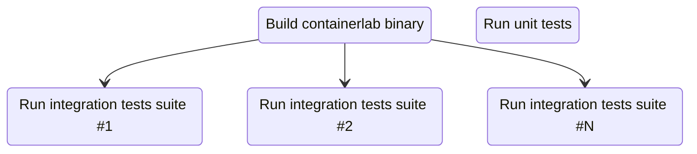

# Test coverage for Go integration tests

I have been working on [containerlab](https://containerlab.dev) for a while now; a project that once started as a simple idea of a tool that would create and wire up SR Linux containers grew into a full-blown network emulation tool loved by the community and used in labs by many.

As it became evident that many more users started to rely on containerlab for their daily work, the looming feeling of responsibility for the quality of the tool started to creep in. At the same time, the growing user base exposed us to many more feature requests and integrations, making it harder to find time to address technical debt and improve testing.

Given the nature of the project, it was clear that integration tests offer a quick way to validate the functionality, as we could replicate the user's workflow and verify the outcome. However, the integration tests are not without their own challenges, and one of them is the test coverage which is not as easy to get as with unit tests.

In this post, I will share how coverage enhancements introduced in Go 1.20 helped us to get the coverage for our integration tests and jump from a miserable 20% to a (less sad) 50%.

<!-- more -->

## Why not unit tests?

You might wonder if it would be easier, more correct, faster, and more proper to write unit tests and get the coverage out of the box. Well, yes, but also no.

Like in the meme "draw an owl" writing unit tests for a `sum(a,b int) int` is easy, but crafting tests for interactions with container runtimes is not. Mocking, interface stubs generation, state management and other things that come with unit tests are not always easy to implement and maintain. Especially if you're not a pro Go developer with years of experience.

Consequently, when I looked at what it'd take to write proper unit tests for containerlab, I decided to go with integration tests instead. The integration tests are easier to write, and they are more representative of the user's workflow. Yes, they run way slower, but that's a trade-off I was willing to make.

## Containerlab integration tests

People are debating which integration test runners are better. Some popular options are [bats](https://bats-core.readthedocs.io/en/stable/), [ginkgo](https://onsi.github.io/ginkgo/), [Robot Framework](https://robotframework.org/), and many others. I've been working with Ginkgo and Robot, but given that I had more experience with Robot, I decided to go with it.

!!!tip
    Robot Framework is a Python-based test automation framework that allows you to write tests in a human-readable format (business-driven testing). Tests are written in a keyword-driven style which makes it easy to create readable tests.

An example of a Robot test that deploys a test topology and verifies that the nodes are up and running, and links are opertional[^1]:

```robotframework
*** Test Cases ***
Deploy ${lab-name} lab
    ${rc}    ${output} =    Run And Return Rc And Output
    ...    sudo -E ${CLAB_BIN} --runtime ${runtime} deploy -t ${CURDIR}/${lab-file}

    Should Be Equal As Integers    ${rc}    0

Verify links in node l1
    ${rc}    ${output} =    Run And Return Rc And Output
    ...    ${runtime-cli-exec-cmd} clab-${lab-name}-l1 ip link show eth1
    
    Should Be Equal As Integers    ${rc}    0
    Should Contain    ${output}    state UP

    ${rc}    ${output} =    Run And Return Rc And Output
    ...    ${runtime-cli-exec-cmd} clab-${lab-name}-l1 ip link show eth2

    Should Be Equal As Integers    ${rc}    0
    Should Contain    ${output}    state UP
```

For the sake of this post, I will not go into the details of how RF test suites are built; it is sufficient to say that the tests are started by invoking a [shell script](https://github.com/srl-labs/containerlab/blob/main/tests/rf-run.sh) that runs the `robot` command that starts the test execution.

```bash title="snippet from rf-run.sh script"
GOCOVERDIR=${COV_DIR} robot --consolecolors on -r none \
  --variable CLAB_BIN:${CLAB_BIN} --variable runtime:$1 \ 
  -l ./tests/out/$(basename $2)-$1-log \
  --output ./tests/out/$(basename $2)-$1-out.xml $2
```

The integration tests use the `containerlab` binary that is built using the tip of the branch that is being tested. Unit tests and integration tests run in parallel allowing to identify error in both test suites. The following diagram shows the relationship between the unit and integration tests:



In reality, this translates into the following GitHub actions pipeline:

<figure>
    
    <figcaption>containerlab CI pipeline</figcaption>
</figure>

These integration tests themselves run in parallel and provide good coverage of the containerlab functionality. However, it was hard to quantify the coverage of the tests because test coverage from the integration tests is not reported by default. Thankfully, starting with Go 1.20 it is now possible to build a binary that will report the test coverage when running it, but the whole process has some quirks, so let's dive into it.

## Test coverage for Go binaries

When I first read the Go 1.20 release notes, I got excited about the new test coverage feature. It seemed like a perfect fit for containerlab integration tests; we could finally bump our test coverage by simply running the tests with a new binary. However, it turned out that it was not just a matter of building a binary with a certain flag; there is more to it.

To my surprise, Dustin was quick enough to [write a blog post](https://dustinspecker.com/posts/go-combined-unit-integration-code-coverage/) about the new feature and how to use it with the unit test coverage. Here I will mainly refer to his blog post and provide references to containerlab code to put things into the context of a real project.

### Building a binary with test coverage

As I referred to above, the new feature that allows to get test coverage assumes that users build a binary with the test coverage enabled. This is done by passing the `-cover` flag to the `go build` command.

In containerlab's case this is done in the [Makefile](https://github.com/srl-labs/containerlab/blob/main/Makefile#L34) where we build a binary used in tests only; it has race detection and debugging extenstions enabled, so we just added `-cover` flag to the mix.

### Running tests with coverage

The new binary is ready, now we can run the same integration tests as before, expecting to get the coverage report. Besides the binary, we have to set the `GOCOVERDIR` env var that will tell the Go runtime where to store the coverage report. In [our case](https://github.com/srl-labs/containerlab/blob/fbf59f948e92609d9c405020823f57fb4af0ef9a/tests/rf-run.sh#L18-L23) we set the env var in the test runner script.  
Without having this env var set the coverage report won't be generated at all.

The new binary format of the test coverage report is not human-readable, so one would have to convert as [Dustin shows](https://dustinspecker.com/posts/go-combined-unit-integration-code-coverage/#run-the-binary-to-collect-coverage). But we don't do this in our CI, because our goal is to merge the coverage from all the integration tests and unit tests into a single report, and this requires some tinkering.

### Merging coverage reports

The test coverage report that you typically get when executing `go test` with coverage profile enabled is a single text file that coverage reporting tools like Codecov and Coveralls parse. Easy, but this coverage profile format is incompatible with the coverage data generated after you run the binary with coverage support.

So what do we do? We run the `go test` and ask it to produce coverage data that is in the same binary format so that later we could merge the two.

In the CI we use the [`test` make target](https://github.com/srl-labs/containerlab/blob/fbf59f948e92609d9c405020823f57fb4af0ef9a/Makefile#L41C1-L43C31) which runs `go test` and leverages a dirty workaround of setting the `goverdir` arg to output the coverage dir so that we get the coverage data in the binary format we need.

```Makefile
test:
    rm -rf $$PWD/tests/coverage
    mkdir -p $$PWD/tests/coverage
    CGO_ENABLED=1 go test -cover -race ./... -v -covermode atomic -args -test.gocoverdir="$$PWD/tests/coverage"
```

The coverage data appears in the `./tests/coverage` dir that we set as the `GOCOVERDIR` env var when running the integration tests. As a result, we will get the coverage data from both unit and integration tests in the same format. Now we need to merge them and produce a coverage profile.

And here again the batteries are included in the `go` tool. All we have to do is:

```bash
go tool covdata textfmt -i=./tests/coverage -o coverage.out
```

And voila, we get the `coverage.out` in the text format that we can pass to Codecov or Coveralls.

## Codecov integration

The last piece of the puzzle is how to do all these steps in a CI environment where different test jobs run separately. In our case, we have a separate job for unit tests and each integration test suite. Since we need to get coverage reports from each of them, we have to use GitHub Actions artifacts to pass the coverage data between the jobs.

To achieve this goal, each coverage-producing job uploads the coverage data to the GitHub artifacts, and the last job downloads all the coverage data and merges it into a single report. Here is how it looks like in the CI pipeline:

<figure>
    
    <figcaption>Coverage pipeline</figcaption>
</figure>

[The `coverage` job](https://github.com/srl-labs/containerlab/blob/fbf59f948e92609d9c405020823f57fb4af0ef9a/.github/workflows/cicd.yml#L469) is a simple sequence of steps that downloads the coverage data from the artifacts, merges it, and uploads the merged coverage report to the artifacts again. The `coverage` job is triggered only when all the test coverage-producing jobs are finished.

```yaml
  coverage:
    runs-on: ubuntu-22.04
    needs:
      - unit-test
      - smoke-tests
      - ext-container-tests
      - ceos-basic-tests
      - srlinux-basic-tests
      - ixiac-one-basic-tests
    steps:
      - name: Checkout
        uses: actions/checkout@v3
        with:
          fetch-depth: 0
      - uses: WillAbides/setup-go-faster@v1.10.1
        with:
          go-version: ${{ env.GOVER }}
      - uses: actions/download-artifact@v3
        with:
          name: coverage
          path: tests/coverage
      - name: convert Go's binary coverage to text coverage
        run: make convert-coverage
      - name: Upload coverage to codecov
        uses: codecov/codecov-action@v3
```

And that's it; now we can enjoy the coverage report that combines the coverage from unit and integration tests.

[^1]: Snippet from the [full test](https://github.com/srl-labs/containerlab/blob/fbf59f948e92609d9c405020823f57fb4af0ef9a/tests/01-smoke/01-basic-flow.robot).
